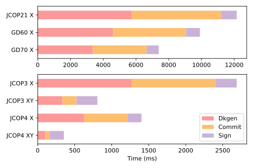

# MultiSchnorrApplet

A JavaCard applet implementing the first party of the MultiSchnorr multi-signature scheme. Use with the [MultiSchnorrReader](https://github.com/jjanku/MultiSchnorrReader/).

Before using the applet with the reader app, it is recommended to run the correctness tests first. Otherwise the app may time out during the applet's initialization on older cards.

## Cards

Before attempting to run the applet on a physical card, make sure to set the correct card in [MainApplet](applet/src/main/java/applet/MainApplet.java)'s constructor:

```java
public MainApplet(byte[] buffer, short offset, byte length) {
    // ...
    support.setCard(OperationSupport.SIMULATOR);
    // ...
}
```

The applet was tested on the following cards: `JCOP21`, `JCOP3_P60`, `JCOP4_P71`, `GD60`, and `GD70`. Depending on the JavaCard version supported by the given card, it may be necessary to change `JC_SELECTED` in [build.gradle](applet/build.gradle). In particular, set `JC_SELECTED = JC303` for `JCOP21` and `GD60`.

## Build

```bash
./gradlew buildJavaCard
```

The built CAP file is located in `./applet/build/javacard`.

## Install

```bash
./gradlew installJavaCard
```

Alternatively, install the CAP file using [GlobalPlatformPro](https://github.com/martinpaljak/GlobalPlatformPro).

## Test

By default, the tests run the applet in a simulator. If a physical card should be used instead, specify it in the test's constructor as follows:

```java
public Test() throws Exception {
  setCardType(CardType.PHYSICAL);
}
```

Correctness tests ([AppletTest.java](applet/src/test/java/tests/AppletTest.java)):

```bash
./gradlew test --tests AppletTest --rerun-tasks
```

Performance tests ([PerformanceTest.java](applet/src/test/java/tests/PerformanceTest.java)):

```bash
./gradlew test --tests PerformanceTest.full --rerun-tasks
```

If `OperationSupport.EC_HW_XY` is set to `true`, it is sufficient to use `PerformanceTest.noProb`. The `full` test runs slower and provides no new information in this case. However, if you want to test the probabilistic signing optimization, make sure to set `support.EC_HW_XY = false` in [MainApplet](applet/src/main/java/applet/MainApplet.java)'s constructor and run the `full` test.

The results are saved to `applet/measurements.csv`.

## Performance




The measured data and their analysis can be found in [perf](perf).

To replicate the results, intall the applet on your card and run `PerformanceTest` as described. To analyze them, copy `applet/measurements.csv` to `perf/dava/`, the target file should end with `-x.csv` if `PerformanceTest.full` was used and with `-xy.csv` otherwise (see the structure of the existing files).

## Troubleshooting

See the [javacard-gradle-template](https://github.com/ph4r05/javacard-gradle-template) this project is based on for more information.
